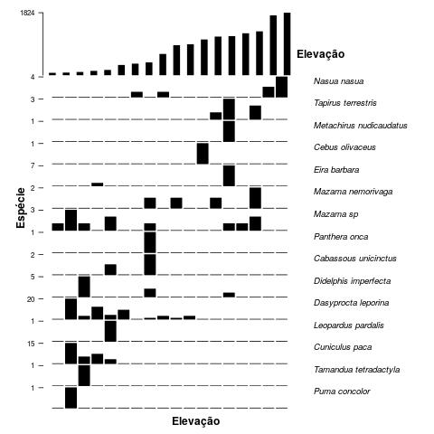

# Uei-tepui

Analises de dados de levantamento com armadilhas fotográficas no Uei-tepui (Wîi-tîwî), Parque Nacional do Monte Roraima

Por Elildo Carvalho Jr @ICMBio/CENAP



### Descrição
```src``` Este diretório contém os códigos para as análises.

```data``` Dados da amostragem com armadilhas fotográficas no Uei-Tepui several Amazonian sites. 

```bin``` Códigos e funções úteis que são chamadas pelos códigos principais que estão na pasta```src```.

```results``` Contém os resultados das análises, como tabelas e figuras. 

# Contato
Se tiver questões, favor entrar em contato: <elildojr@gmail.com>
